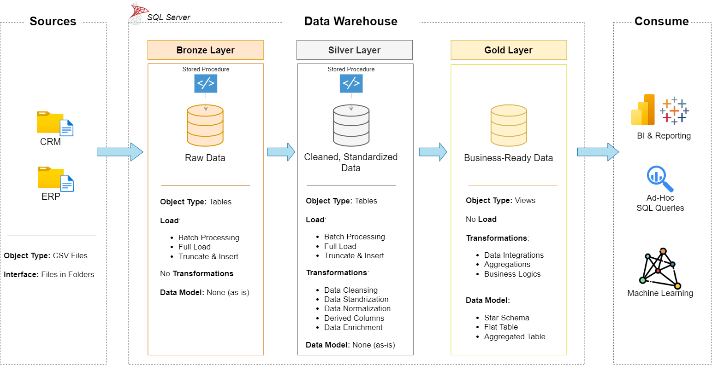

# 🚀 Data Warehouse & Analytics Project  

Welcome to my **Data Warehouse & Analytics Project** — where raw data goes in confused, comes out polished, and (hopefully) tells you something useful.  

This project is my attempt at building a **modern data warehouse** using the Medallion Architecture (**Bronze → Silver → Gold**) and sprinkling in a bit of analytics magic ✨. Think of it as taking CSVs on a spa day — cleanse, transform, and shine.




---

## 🏗️ Data Architecture  

We follow the **Medallion Architecture** (fancy name, simple idea):  

- **🥉 Bronze Layer** – Raw data dumped straight from ERP & CRM CSV files into SQL Server. No judgments, just as-is.  
- **🥈 Silver Layer** – Data goes through a shower, a haircut, and maybe a pep talk (cleansing, normalization, standardization).  
- **🥇 Gold Layer** – Star schema models ready for analytics. This is where the real insights happen.  

---

## 📖 Project Overview  

What I did:  
- **Data Architecture** – Designed a warehouse using the Bronze/Silver/Gold approach.  
- **ETL Pipelines** – Built SQL scripts to Extract, Transform, and Load data.  
- **Data Modeling** – Fact & Dimension tables optimized for reporting.  
- **Analytics & Reporting** – SQL-based analysis on customers, products, and sales trends.  

Basically, I turned CSV chaos into something business-ready.  

---

## 🎯 Skills Highlighted  

This repo is perfect for showcasing skills in:  
- SQL Development  
- Data Engineering & ETL  
- Data Modeling (Star Schema)  
- Data Analytics & Reporting  
- And most importantly: **making messy data slightly less messy**  

---

## 🛠️ Tools & Tech  

- **SQL Server Express** – Database engine of choice  
- **SSMS** – Because clicking buttons sometimes feels easier than typing queries  
- **Draw.io** – For diagrams (because every good project needs at least one triangle and some arrows)  
- **GitHub** – Where this masterpiece now lives  

---

## 📂 Repository Structure  

```data-warehouse-project/
│
├── datasets/                           # Raw datasets used for the project (ERP and CRM data)
│
├── docs/                               # Project documentation and architecture details
│   ├── data_architecture.drawio        # Draw.io file shows the project's architecture
│   ├── data_catalog.md                 # Catalog of datasets, including field descriptions and metadata
│   ├── data_flow.drawio                # Draw.io file for the data flow diagram
│
├── scripts/                            # SQL scripts for ETL and transformations
│   ├── bronze/                         # Scripts for extracting and loading raw data
│   ├── silver/                         # Scripts for cleaning and transforming data
│   ├── gold/                           # Scripts for creating analytical models
│
├── tests/                              # Test scripts and quality files
│
├── README.md                           # Project overview and instructions
└── LICENSE                             # License information for the repository
```

---

## 📊 Analytics & Insights  

The SQL reports answer fun business questions like:  
- Who are our best customers (and who ghosted us)?  
- Which products are stars and which are… let’s just say "learning opportunities"?  
- Sales trends – AKA “should we panic or celebrate this quarter?”  

---

## 🛡️ License  

MIT License – feel free to use, modify, and share.

---

## 🌟 About Me  

I’m **Ayaz Munis** – a data enthusiast dedicated to building modern data solutions and uncovering insights that drive smarter decisions.  

Connect with me on:  
[LinkedIn](https://www.linkedin.com/in/ayazmunis/) • 
